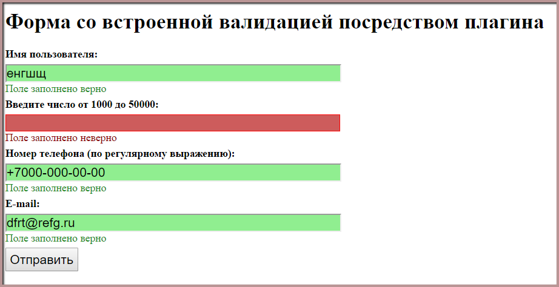
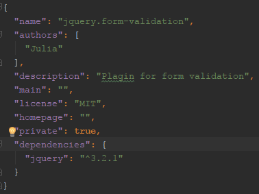

##  Плагин для валидации пользовательских данных
jQuery.form-validation - это плагин jQuery, написанный  на языке JavaScript, и предназначенный для проверки полей формы в браузере (IE 9+, все современные браузеры текущей версии и версии -1). Плагин осуществляет проверку полей при заполнении пользователем формы.



### Установка

Необходимо скачать архив.
Архив содержит 2 директории: 
+ dist с файлом стилей .css и файлом js;
+ директорию demo с основным файлом index.html.

Как установить плагин из архива:

1. Распакуйте архив.
2. Скачайте и подключите  библиотеку jQuery (jQuery.com) к своему проекту. Если вы используете bower, выполните команду bower install jquery в консоли;
3. Инициализируйте зависимости с помощью файла bower.json;



3. Подключите скрипт jquery.form-validation.js на свою страницу.
4. Подключите стили jquery.form-validation.css

### Запуск Демо-версии

Демо версия находится в папке demo. Для запуска демо откройте в браузере файл index.html.

### Валидаторы

Проверки определяются с помощью заданных data атрибутов элемента input. Вот несколько примеров того, как это происходит:

```html
<div class="fv-form-group">
        <label for="name">Имя пользователя:</label>
        <input type="text" id="name" name="name"
               data-fv-validator="string"
               data-fv-min="3"
               data-fv-max="10"
               data-fv-required="true"
               data-fv-pattern="^[a-zа-яё]+$"
               data-fv-success="Поле заполнено верно"
               data-fv-error="Введите Ваше настоящее имя">
</div>

```

#### Валидатор для строк

Валидация строк осуществляется с помощью метода function validatorString(item).
Обязательные атрибуты:

+  тип валидатора "строка": data-fv-validator="string";
+  атрибут верного заполнения поля: data-fv-success "Поле заполнено верно";
+  атрибут ошибки: data-fv-error="Введите Ваше настоящее имя".
 
 Все остальные атрибуты - необязательные:
 
 data-fv-min = "3", минимальная длина строки 3 символа;
 
 data-fv-max = "10", максимальная длина строки 10 символов;
 
 data-fv-required = "true", атрибут обязательного поля;
 
 data-fv-pattern = "^[a-zа-яё]+$" - регулярное выражение, только буквы латинского и кириллического алфавита;
 
 При необходимости можно заменить их на свои.

#### Валидатор для чисел
 Валидация для чисел осуществляется с помощью метода function validatorNumber(item).
 
 Обязательные атрибуты:
 
 +  тип валидатора "число": data-fv-validator="number";
 
  
  Все остальные атрибуты - необязательные:
  
  data-fv-min = "1000", минимальное  число 1000;
  
  data-fv-max = "5000", максимальное число 5000;
  
  data-fv-required = "true", атрибут обязательного поля;
  
При необходимости можно добавить или  заменить их на свои.
 
#### Валидатор для e-mail

Валидация для e-mail осуществляется с помощью метода function validatorEmail(item).

Обязательные атрибуты:

+ тип валидатора "e-mail": data-fv-validator="email";

Все остальные атрибуты - необязательные:

data-fv-required="true", атрибут обязательного поля.

#### Проверка по регулярному выражению

Валидация по регулятному выражению осуществляется с помощью метода function validatorPattern(item)

Обязательные атрибуты:
+ тип валидатора "regexp":data-fv-validator="regexp";
+ регулярное выражение: data-fv-pattern.
